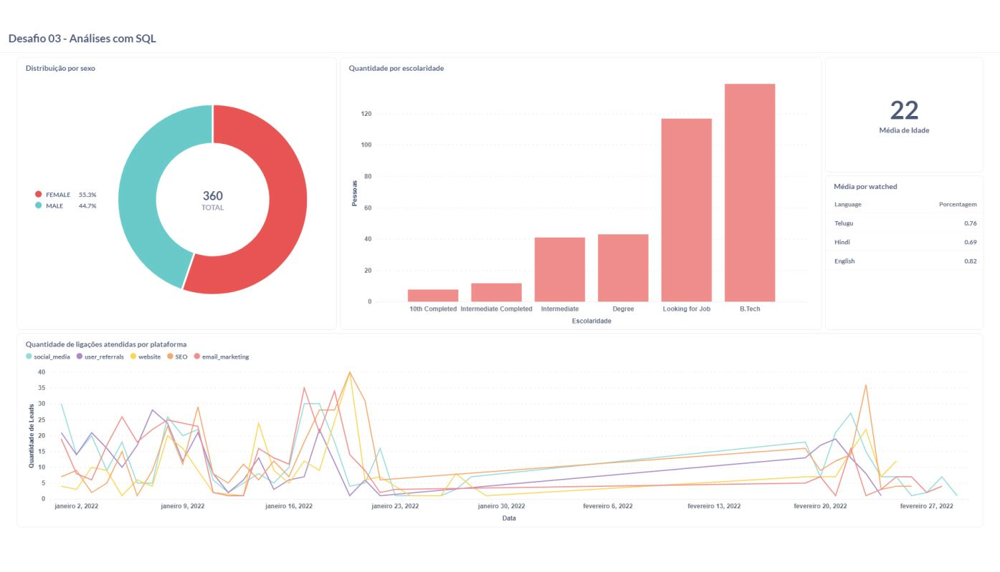

# Construção de dashboard e apresentação a partir de análises com SQL

### Contexto
Uma empresa Edtech está focada em acelerar seu crescimento aumentando o número de usuários cadastrados. Portanto, foi solicitado uma análise de vários aspectos da aquisição de clientes para ver o status do crescimento de novos usuários na empresa.

A empresa disponibilizou algumas bases de dados:
* leads_basic_details
* sales_managers_assigned_leads_details
* leads_interaction_details
* leads_demo_watched_details
* leads_reasons_for_no_interest

### Passos das análises

1. Partindo da tabela "leads_basic_details" realizei a contagem por lead_id (identificador único dos leads) e o gênero e então agrupei pelo gênero. Após isso, selecionei o gráfico de pizza para a exibição desses passos.
```sql
--Gráfico de pizza - Contagem e agrupamento por gênero
select 
    count(lead_id), gender   
from leads_basic_details
group by gender
```
2. Partindo da tabela "leads_basic_details" realizei a média das idades da coluna "age" com a função "avg()", e então arredondei o resultado para o número inteiro mais próximo com a função round(). Posteriormente renomeei a coluna resultante como "Média". A exibição foi 
```sql
--Gráfico de cartão - Média por idade
select 
   round(avg(age)) as "Média" 
from leads_basic_details
```

3. Partindo da tabela "leads_basic_details" selecionei a contagem de lead_id, renomeando-a como "Pessoas", e a coluna current_education.Então agrupei os resultados pela coluna current_education, permitindo contar o número de leads para cada nível educacional. Posteriormente ordenei os resultados com base na contagem de "Pessoas" em ordem crescente. A exibição foi feita através de um gráfico de barras.
```sql
--Gráfico de barras - Leads por nível educacional
select 
   count(lead_id) as "Pessoas", current_education 
from leads_basic_details
group by current_education
order by Pessoas
```

4. Partindo da tabela "leads_demo_watched_details" renomeei a coluna language para Language e calculei a média dos valores da coluna "watched_percentage" que renomeei também para Porcentagem. Então filtrei os resultados dessa nova coluna Porcentagem com a função "where" para incluir apenas os valores maior que 0.5. Posteriormente agrupei os resultados por language, permitindo que a média fosse calculada para cada idioma separadamente, e utilizei o order by para ordenar os resultados em ordem decrescente com base na média da coluna Porcentagem. A exibição foi feita através de uma tavela convencional.
```sql
--Tabela -  Médias de watched maior que 0.5 
select 
   language as Language, 
   avg(watched_percentage) as Porcentagem
from leads_demo_watched_details
where watched_percentage > 0.5
group by language
order by watched_percentage desc
```

5. Realizei um LEFT JOIN entre as tabelas "leads_interaction_details" (A) e "leads_basic_details" (B) com base na correspondência dos IDs dos leads. Então selecionei a data da ligação (call_done_date), a fonte de geração de leads (lead_gen_source) e a contagem de status de chamadas (call_status), renomeando essa contagem como quantidade_ligacoes. Realizei um filtro com Where para incluir apenas chamadas bem-sucedidas (call_status = "successful"), e depois agrupei os resultados pela data da chamada e pela fonte de geração de leads. A exibição foi feita atraves de um gráfico de linhas, mostrando a quantidade de ligações atendidas por plataforma ao longo do tempo.
```sql
--Gráfico de linhas - Quantidade de ligações atendidas por plataforma ao longo do tempo 
select 
    A.call_done_date, B.lead_gen_source, count(A.call_status) as quantidade_ligacoes
from leads_interaction_details A
left join leads_basic_details B on A.lead_id = B.lead_id
where A.call_status = "successful"
group by A.call_done_date, B.lead_gen_source
```

## 📸 Visualização do Dashboard



[⬅️ Voltar para o início](index.md)
